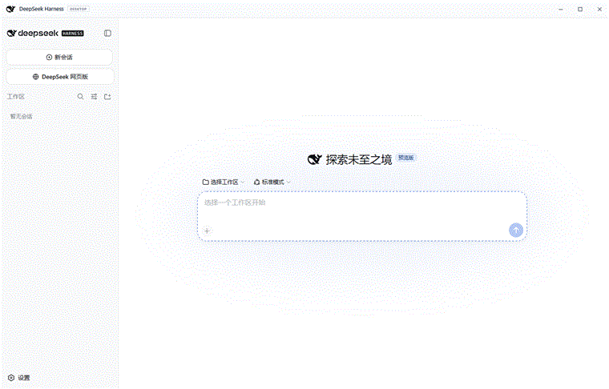

# AI Desktop Web Switcher

> Add a "Web" entry to any Electron AI desktop client: a sidebar button that opens the
> web chat in the main area. **Ask quick questions on the web version — no API token consumed.**

[中文说明](README.md) · [Porting guide](PORTING.md)

## In one line

AI desktop apps use the token-billed API. But many quick questions — a translation, a
calculation, small talk — are free on the web chat. This tool keeps the web version and your
client side by side, one click apart.

## Demo



Click the "DeepSeek 网页版" button in the sidebar → the web chat opens in the main area; click
the button again (or "New Chat") → it closes and you are back to your conversation.

## Features

- 🧭 **Sidebar button** — styled like "New Chat"; label and URL customizable
- ⚡ **One-click toggle** — click to open, click again (or click "New Chat") to close
- 🎨 **Theme-aware** — light theme follows the host app
- 🔒 **Session isolation** — separate login and cookies, fully independent of your API chats
- 🧩 **Universal core** — dependency-free Electron module, port to any Electron AI client
  (see the [porting guide](PORTING.md))
- ♻️ **Fully reversible** — one-command uninstall

## Why not an iframe?

`chat.deepseek.com` (and most AI web chats) sends `Content-Security-Policy: frame-ancestors
'none'`, so a plain `<iframe>` is blocked by the browser. This tool creates a native
`WebContentsView` in the shell's main process — native views are not subject to that CSP, and
it is the same mechanism these clients already use to load their own UI.

## Quick start

> Prerequisites: Windows and Node.js (the script uses `npx @electron/asar`).

```powershell
git clone https://github.com/<your-username>/ai-desktop-web-switcher.git
cd ai-desktop-web-switcher
.\install.ps1                       # defaults to deepseek-harness-desktop
.\install.ps1 -Label "Free Web Chat"
```

Restart your client. The "Web" button appears in the sidebar.

## Supported clients

| Adapter | Status | Notes |
| --- | --- | --- |
| [deepseek-harness-desktop](adapters/deepseek-harness-desktop) | ✅ Out of the box | Third-party Electron shell for `@deepseek-ai/dsh` |
| Other Electron AI clients | 🧩 See [porting guide](PORTING.md) | Three-step integration; adapters welcome |

## Customize

Edit the user config (auto-created on first install):

```
%APPDATA%\deepseek-harness-desktop\deepseek-browser.json
```

```json
{ "label": "DeepSeek 网页版", "url": "https://chat.deepseek.com/" }
```

## Uninstall

```powershell
.\uninstall.ps1
```

## Layout

```
├── lib/
│   ├── web-switcher.js    # universal core module (Electron-only, zero deps)
│   └── preload.js         # universal preload bridge
├── adapters/
│   └── deepseek-harness-desktop/
│       ├── main.js
│       ├── preload.js
│       └── README.md
├── install.ps1
├── uninstall.ps1
└── PORTING.md
```

## FAQ

**No button?** Confirm the script printed "安装完成" and that you restarted the app. The button
shows as an icon when the sidebar is collapsed.

**Login page?** Normal. The web version uses its own account (unrelated to your API key).

**Conflicts?** No. The web view uses an isolated `partition`; login state and cookies are fully
separate from the host client.

## License

[MIT](LICENSE)

## Disclaimer

This is a general-purpose enhancement and does not bypass any app's authorization or billing.
Web-chat services belong to their respective vendors; availability and pricing are subject to
them. Not affiliated with DeepSeek or any AI vendor.
